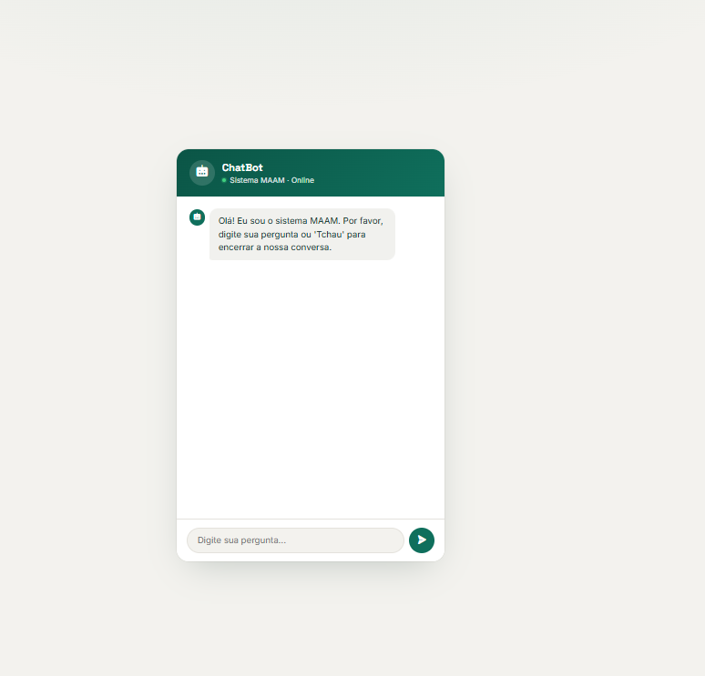

<p align="center">
  
</p>

<h1 align="center">🤖 ChatBot</h1>

<p align="center">
  Chatbot de perguntas e respostas com reconhecimento de palavras-chave, interface de chat e backend em Python.
</p>

---

## Sobre este repositório

Este projeto é uma **adaptação** do [ChatBot original criado por Maria Machado](https://github.com/MaaMachado/chatbot),
desenvolvido como atividade final da UC15 (Implementação de Inteligência Artificial) do curso Técnico em
Desenvolvimento de Sistemas — Senac. Todo o crédito pela concepção original, pela integração Python + PHP e pela
lógica inicial de perguntas e respostas é dela.

A partir do projeto original, fiz as seguintes adaptações nesta versão:

- **Interface reformulada**: layout de chat de verdade, com bolhas de mensagem, avatar, indicador de "digitando..."
  e histórico da conversa (antes era uma única caixa de pergunta/resposta)
- **Motor de respostas mais robusto**: a comparação agora é feita por frase completa (não mais palavra solta), e
  foi adicionada correspondência aproximada (fuzzy matching, via `difflib`) para tolerar erros de digitação e
  pequenas variações na forma de perguntar
- **Novas categorias de resposta**: idade, agradecimento, pedido de ajuda e "quem criou o bot"
- **Correção de compatibilidade**: ajuste para versões mais recentes do NLTK (download do recurso `punkt_tab`)
- **Instruções de instalação adaptadas para o Laragon** (em vez de XAMPP)

## Como funciona

O usuário digita uma pergunta na interface de chat. O JavaScript envia essa pergunta via AJAX para um script PHP
(`conectChat.php`), que repassa a pergunta para uma API Python feita em Flask (`chatbot.py`). O Flask processa o
texto (normalização + comparação por frase + correspondência aproximada) e devolve a resposta mais adequada, que é
exibida na tela como uma nova bolha de mensagem.

```
Navegador (JS)  →  conectChat.php  →  API Flask (chatbot.py)
   bolhas de chat      ponte PHP         processamento da pergunta
```

## Tecnologias utilizadas

- **Python** — Flask (API) e NLTK (tokenização)
- **PHP** — ponte entre o frontend e a API Python
- **HTML, CSS e JavaScript** (jQuery) — interface de chat
- **Phosphor Icons** — ícones da interface

## Como rodar o projeto

Este projeto precisa de dois servidores rodando ao mesmo tempo: o **Laragon** (para o PHP) e o **Python/Flask**
(para a API do chatbot).

### 1. Pré-requisitos

- [Laragon](https://laragon.org/) instalado (ou XAMPP/WAMP — qualquer stack com Apache/Nginx + PHP)
- [Python 3.9+](https://www.python.org/downloads/) instalado

### 2. Clone o projeto dentro da pasta `www` do Laragon

```bash
cd C:\laragon\www
git clone https://github.com/SEU_USUARIO/chatbot.git
```

### 3. Instale as dependências Python

```bash
pip install flask nltk --break-system-packages
```

### 4. Inicie o Laragon

Abra o Laragon e clique em **Start All**.

### 5. Rode a API do chatbot

Em um terminal, dentro da pasta do projeto:

```bash
python chatbot.py
```

Na primeira execução, os recursos `punkt` e `punkt_tab` do NLTK são baixados automaticamente — isso é esperado e
só acontece uma vez.

### 6. Acesse no navegador

```
http://localhost/chatbot/index.php
```

> Se o projeto estiver dentro de uma subpasta (ex: `www/sistemas/chatbot`), ajuste a URL de acordo, por exemplo:
> `http://localhost/sistemas/chatbot/index.php`

### 7. Converse com o bot

Experimente perguntas como:

- "Olá" / "Oi"
- "Tudo bem?"
- "Qual é o seu nome?"
- "O que você faz?"
- "Quantos anos você tem?"
- "Quem te criou?"
- "Obrigado"
- "Tchau"

## Limitações

Este é um chatbot baseado em **reconhecimento de palavras-chave**, não em inteligência artificial generativa —
ele só responde ao que já está programado nas categorias de `chatbot.py`. Perguntas fora desse escopo (conhecimento
geral, cálculos, etc.) recebem uma resposta padrão pedindo para reformular.

## Créditos

- Projeto original: [Maria Machado](https://github.com/MaaMachado/chatbot)
- Ícones: [Phosphor Icons](https://phosphoricons.com/)
